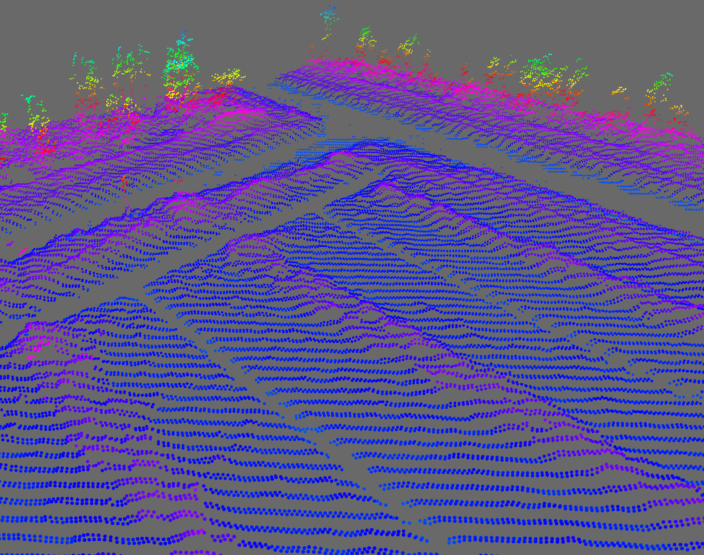
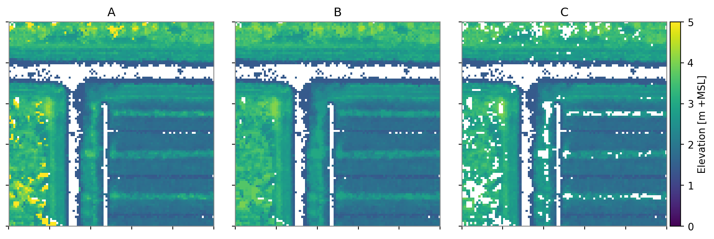

[](https://zenodo.org/badge/latestdoi/178010374)
# ALS to DTM 

All code required to create DTMs from raw `.las` or `.laz` files. Uses the morphological filter from *Zhang et al. (2003)*[1] for filtering ground points.
Code used in *Vernimmen et al. 2019. Creating a lowland and peatland landscape DTM from interpolated partial coverage LiDAR data for Central Kalimantan and East Sumatra. Remote Sensing 11, 1152* [2] [](https://doi.org/10.3390/rs11101152)

## Derived packages
This is an archived copy of a part of our complete LiDAR pipeline, running on Julia 0.6 (unmaintained as of 4/2/2019).
We advise to use our derived, more generic open-source packages:
- [GeoRasters.jl](https://github.com/evetion/GeoRasters.jl) For spatial raster creation (replaces PeatUtils).
- GeoRasterFiltering.jl (coming soon) For spatial filters (replaces GridOperations).
- [PointCloudRasterizers.jl](https://github.com/Deltares/PointCloudRasterizers.jl) For rasterizing and filtering pointclouds (replaces XYZ).
- [LasIO.jl](https://github.com/visr/LasIO.jl) Native parser for the .las data format.
- [LazIO.jl](https://github.com/evetion/LazIO.jl) Extends LasIO for using compressed .laz data.


## Installation
Download Julia 0.6 @ https://julialang.org/downloads/oldreleases.html.
Run the `install.jl` script to install necessary packages.

For using the modules with your own scripts, add the Modules folder to your `LOADPATH` by using:
`push!(LOAD_PATH, "modules")`

For using `.laz` files, this requires a working version of `laszip` in your path.

## Usage

*ALS data example: data/small.laz Note the low vegetation on the mounds. Visualization in Displaz.*


```julia
push!(LOAD_PATH, "modules")
include("lidar_pipeline.jl")

infile = "data/small.laz"
outfolder = "output/"
epsg = 32748

# PMF settings
radius = 16.
slope = 0.6
dhmax = 1.1
dhmin = 0.5

lidar_pipeline(infile, epsg, outfolder, radius, slope, dhmax, dhmin)
```

The `.tiff` files (`_zmin`, `z_max` and `_zmin_filtered`) in the output folder are used in the following figure:


*A) Minimum elevation grid. B) Maximum allowed elevations from PMF filter. C) Resulting DTM where A > B are non-ground points.*


## Related packages
Outside these and derived packages, look at these packages:
- [SpatialGrids.jl](https://github.com/FugroRoames/SpatialGrids.jl) provides 2D and 3D grid structures for working with point cloud data.
- [Displaz](https://github.com/FugroRoames/displaz) A hackable lidar viewer
- [PointClouds.jl](https://github.com/FugroRoames/PointClouds.jl)
Point cloud data structures in pure julia

and also into discussions at
https://github.com/visr/LasIO.jl/issues/4 and https://github.com/FugroRoames/PointClouds.jl/issues/7 in which we actively colloborate to further strengthen the Julia LiDAR ecosystem.

## References
[1]: Zhang, Keqi, Shu-Ching Chen, Dean Whitman, Mei-Ling Shyu, Jianhua Yan, and Chengcui Zhang. “A Progressive Morphological Filter for Removing Nonground Measurements from Airborne LIDAR Data.” IEEE Transactions on Geoscience and Remote Sensing 41, no. 4 (2003): 872–82. https://doi.org/10.1109/TGRS.2003.810682.

[2]: [](https://doi.org/10.3390/rs11101152) Vernimmen, R., Hooijer, A., Yuherdha, A.T., Visser, M., Pronk, M., Eilander, D., Akmalia, R., Fitranatanegara, N., Mulyadi, D., Andreas, H., Ouellette, J., Hadley, W., 2019. Creating a lowland and peatland landscape DTM from interpolated partial coverage LiDAR data for Central Kalimantan and East Sumatra. Remote Sensing 11, 1152, https://doi.org/10.3390/rs11101152. 
